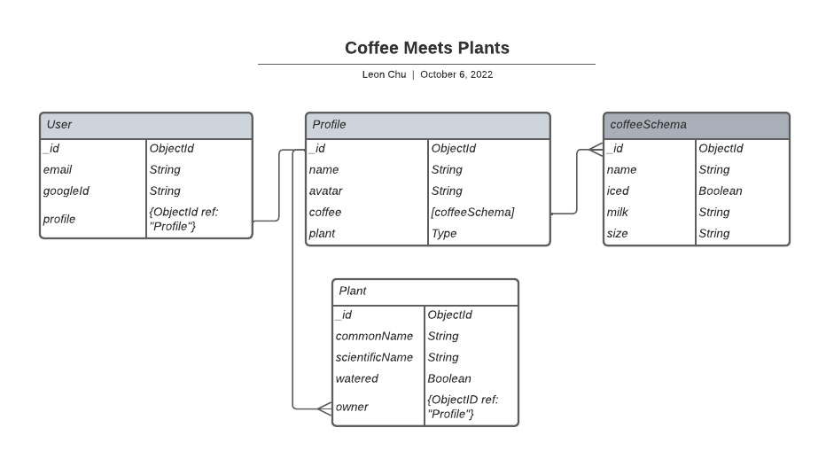
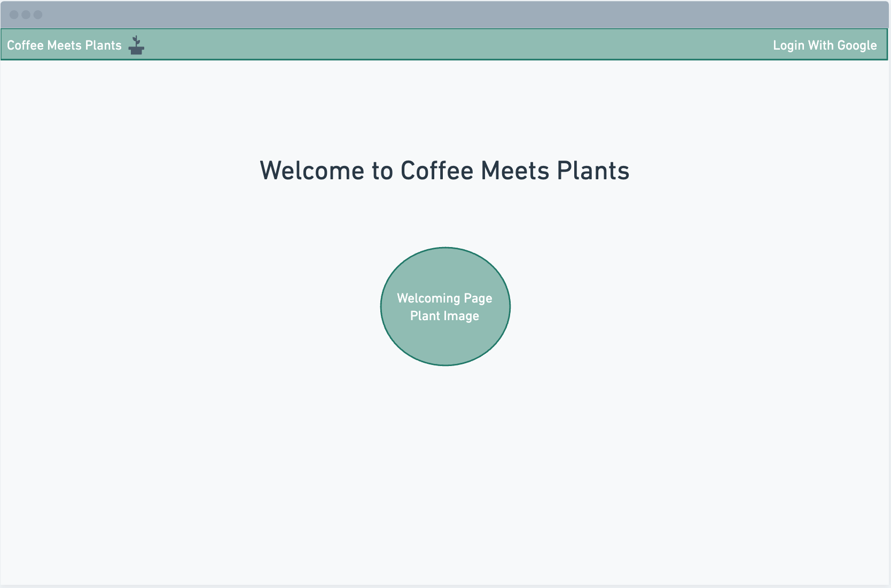
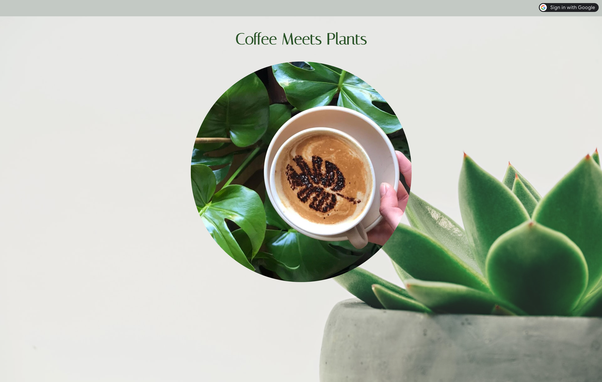

# 🪴 **Coffee Meets Plants** ☕️
---
#### If you told me two years ago today that I would be a proud plant dad to over 50 plants, I would have laughed in your face. It wasn't until during the pandemic that I discovered my green thumb and love for all things related to houseplants. I vividly remember buying my very first houseplant and from that moment, a new found love and passion grew. Just as the world was starting to open back up, I found myself discovering a coffee plant shop in New York City on Columbus Ave. called Plantshed. It was then that I knew that one day, I will open my own coffee/plant shop because why not? I love coffee. I love plants. Therefore, the creation of Coffee Meets Plants was born. I hope you have as much fun enjoying this web app as I had building it!
---
## Check out my website! [Coffee Meet Plants](https://coffee-meets-plants.fly.dev/) 💻
---
# **Planning Materials:**

## Visit my [Trello Board](https://trello.com/b/q0lcPTJB/coffee-meets-plants) 📝
---
## ERD Diagram: 📊

---
## Wireframe: 🔧

---
## Post styling: 🎊
